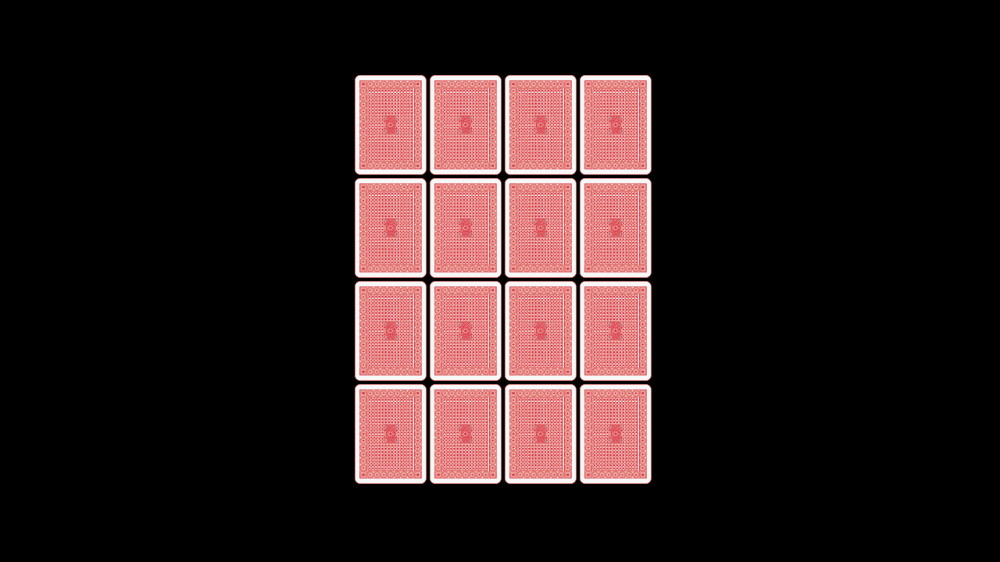

# Memory Card Game

A memory card game where you match two cards together. Three different levels each with different amount cards along with individual time records.
## Requirements
    - PixiJS
    - Live Server (VS Code)
    
# License
This project and its source code is for documentation purposes only. You may not copy or modify this project for your own use, including university projects, open source projects, commercial projects, etc. in partial or in verbatim.

Playing Cards assets by [Mannaggia](https://stock.adobe.com/contributor/200487016/mannaggia?load_type=author&prev_url=detail) is used for this game under educational license:

Navigate to reference playing cards assets used for this game: (https://stock.adobe.com/images/playing-cards/23299310?prev_url=detail)
